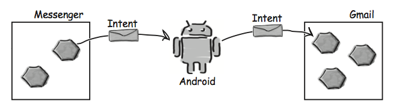

# Как работают приложения Android
Как вам уже известно, Android­-приложения состоят из одной или не­скольких активностей. Каждая активность представляет одну четко определенную операцию, ко­торая может выполняться пользователем. Например, такие приложения, как Gmail, Google+, Facebook и Twitter, содержат активности, позволяющие отправлять сообщения, хотя в каждом приложении эта операция выполняется по­своему.

## Интенты могут запускть активности из других приложений
Вы уже видели, как использовать интент для запуска второй актив­ности из того же приложения. Первая активность передает интент Android; Android проверяет интент, а затем приказывает второй активности запуститься.
Этот принцип относится и к активностям других приложений. Ак­тивность вашего приложения передает интент Android, Android проверяет его, а затем приказывает второй активности запуститься — несмотря на то, что эта активность находится в другом приложении. Например, можно воспользоваться интентом для запуска активности Gmail, отправляющей сообщения, и передать ей текст, который нуж­но отправить. Вместо того, чтобы писать собственные активности для отправки электронной почты, можно воспользоваться готовым приложением Gmail.

## Но мы не знаем, какие приложения установлены на устройстве
Прежде чем вызывать активности из других приложений, необходимо ответить на три вопроса:
- Как узнать, какие активности доступны на устройстве пользователя?
- Как узнать, какие из этих активностей подходят для того, что мы собираемся сделать?
- Как узнать, как использовать эти активности?

К счастью, все эти проблемы решаются при помощи действий (actions). Действия — стандартный механизм, при помощи которого Android узнает о том, какие стандартные операции могут выполняться активностями. Например, Android знает, что все активности, зарегистрированные для действия send, могут отправлять сообщения.

А теперь нужно научиться создавать интенты, использующие действия для получения набора активностей, которые могут использоваться для выполнения стандартных функ­ций — например, для отправки сообщений.
