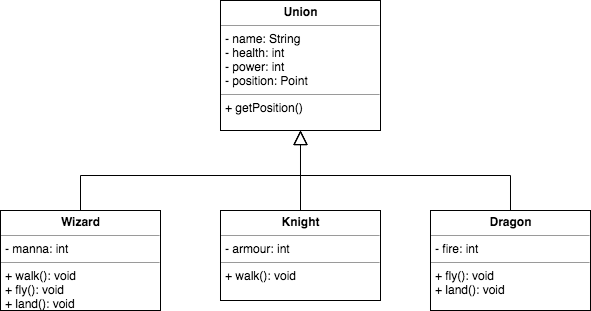
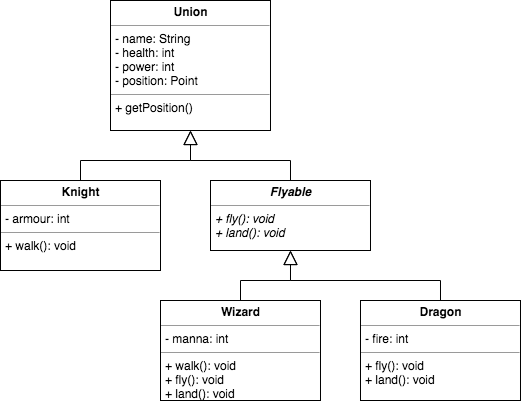
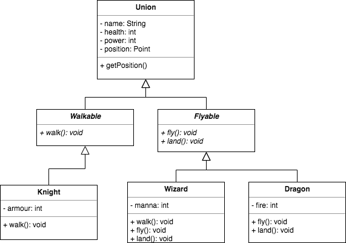
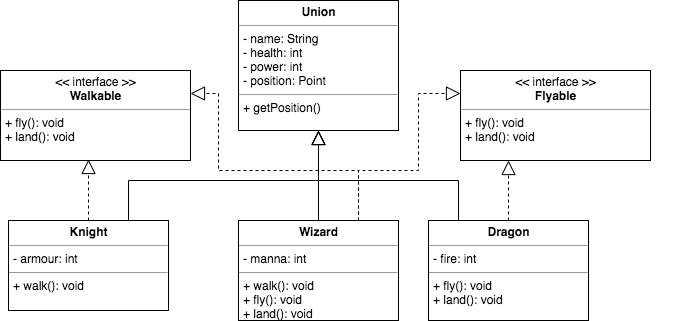

Бывает так, что нам нужно только описать внешний контракт программной сущности, не закладывая никаких деталей реализации. Например, когда реализации настолько различны, что не будут иметь ничего общего между собой.


Wizard и Dragon умеют летать, но сами по себе совершенно отличаются.

Чтобы это реализовать, мы могли бы завести абстрактный классы Flyable, в котором есть только публичные абстрактные методы fly() и land()
```java
public abstract class Flyable {

    public abstract void fly();

    public abstract void land();
}
```
Отнаследовать Wizard и Dragon от него (Knight не должен летать), и реализовать эти методы. 


Но у нас еще есть подобная ситуация с методом walk(). Wizard и Knight умеют ходить. Его тоже надо выделить, и всех умеющих ходить наследовать от него.


Однако тут возникает проблема, в Java, как мы помним, множественное наследование запрещено.

В качестве альтернативы абстрактному классу у которого все методы публичные и абстрактные, в Java заведена отдельная сущность Interface (интерфейс). 


Интерфейс служит для объявления контракта объекта по отношению к внешнему миру.

```java
public interface Flyable {
    void fly();

    void land();
}
```
Для объявления интерфейса используется ключевое слово interface.

Все методы интерфейса, по определению публичные и абстрактные, поэтому явно писать данные модификаторы не требуется.

Реализуемые классом интерфейсы перечисляются после ключевого слова implements через запятую, т.е. класс может реализовывать несколько интерфейсов. Причем класс может реализовывать интерфейсы в дополнение к наследованию.
```java
public class Wizard extends Union implements Flyable, Walkable {
    @Override
    public void fly() {
        //...
    }

    @Override
    public void land() {
        //...
    }

    @Override
    public void walk() {
        //...
    }
}
```

Совсем простые интерфейсы с одним абстрактный методом, называются функциональными. 
```java
@FunctionalInterface
public interface Walkable {
    void walk();
}
```
Это можно дополнительно подчеркнуть поставив анотацию @FunctionalInterface. При наличии такой анотации, компилятор проверит правда ли в интерфейсе единственный абстрактный метод, и если нет, то выдаст ошибку. 
