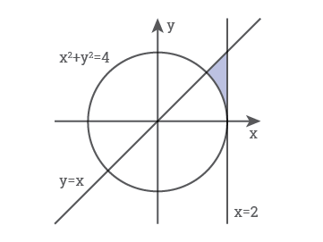
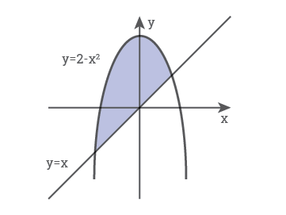
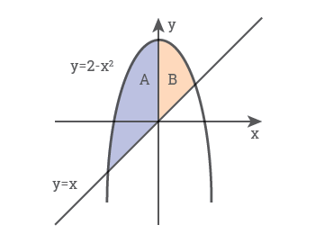

# Условные выражения. Условные операторы.

Условные выражения представляют собой некоторое условие и возвращают значение типа boolean, то есть значение true (если условие истинно), или значение false (если условие ложно). К условным выражениям относятся операции сравнения и логические операции. С условными выражениями программисты работают значительно чаще, чем с поразрядными операциями. Это связано с тем, что в Java из них строятся логические выражения, которые повсеместно используются в условных конструкциях  ветвления и цикла. 

## Операции сравнения
В операциях сравнения сравниваются два операнда, и возвращается значение типа boolean:
true, если выражение верно,
false, если выражение неверно.

В Java существуют следующие операции сравнения:
* >=   больше или равно
* >    строго больше
* <=   меньше или равно
* <    строго меньше
* ==   равно
* !=   не равно

```java
//Пример кода
int a = 4;
int b = 5;
boolean result;
result = (a == b);
result = (a != b);
result = (a < b);
result = (a > b);
result = (a <= 4);
result = (b >= 6);
```

## Логические операции
Также в Java есть логические операции, которые также представляют условие и возвращают true или false и обычно объединяют несколько операций сравнения. 

К логическим операциям относят следующие:
* && И (конъюнкция или логическое умножение)
Результат true, если оба операнда true, в остальных случаях — false.
* || ИЛИ (дизъюнкция или логическое сложение)
Результат false, если оба операнда false, в остальных случаях — true.
* ! НЕ (отрицание)
Унарная операция. Если операнд true, то результат — false, и наоборот.

```java
//Пример кода
int a = 4;
int b = 5;
boolean result;
result = a > b || a < b // (a больше b) логическое или (a меньше b) - true
result = 3 < a && a < 6 // (3 меньше a) логическое и(a меньше 6) - true
result = !result // логическое нет — false
```

Стоит отметить, что в логической операции || вначале будет вычисляться первое значение, и если оно равно true, то вычисление второго значения уже смысла не имеет, так как у нас в любом случае уже c будет равно true. Второе значение  будет вычисляться только в том случае, если первое равно false
В выражении && также сначала будет вычисляться первое значение, и если оно равно false, то вычисление второго значения уже не имеет смысла, так как в любом случае мы получим false. Второе значение будет вычисляться только в том случае, если первое равно true
Поэтому при использовании логических операций на первом месте лучше писать условие, которое требует меньше усилий на проверку.

## Приоритет операций
Чтобы правильно использовать несколько логических операторов в одном выражении, нужно учитывать приоритет операций, который и определяет порядок вычисления результата логического выражения.
Среди логических операций наибольший приоритет у операции !, дальше && и наименьший приоритет имеет операция ||.
В выражениях, где встречаются операторы разных типов, сначала выполняются арифметические операции, затем операции сравнения, затем логические операции и в последнюю очередь присваивание.
В Java нельзя выстраивать цепочки операций сравнения — это строго бинарные операции. Это значит, что двойные условия типа 1≤x≤6 записываются в виде пар логических операций. Для этого нужно разделить такое сложное условие двумя простыми и связать их операцией &&: 1 < x && x < 6

Пример
x < 5 || x > 5 && x < 7 
является истинным для всех значений х, меньших 5 и числа 6, а не для всех значений, меньших 7.

## Тернарный оператор
Тернарный оператор — оператор, который состоит из трех операндов и используется для оценки выражений типа boolean. Тернарный оператор в Java также известен как условный оператор. Цель тернарного оператора или условного оператора заключается в том, чтобы решить, какое значение должно быть присвоено переменной. Оператор записывается в виде: 

<условие> ? <значение, если условие истинно> : <значение, если ложно> 

То есть найти максимальное из двух чисел можно очень просто: max = (a > b ? a : b); 

```java
//Пример кода
int a , b;
 a = 10;
 b = (a == 1) ? 20 : 30;
 System.out.println( "Значение b: " + b );
 System.out.println ((a == 10) ? "a равно 10": "a не равно 10"); 
```

## Условные конструкции
Одним из фундаментальных элементов многих языков программирования являются условные операторы. Данные конструкции позволяют направить работу программы по одному из путей в зависимости от определенных условий.
В языке Java используются следующие условные конструкции: if/else и switch/case.

Конструкция if/else
Выражение if/else проверяет истинность некоторого условия и в зависимости от результатов проверки выполняет определенный код:
Если нам нужно выполнить какую-то последовательность действий при выполнении определенного условия, то используется конструкция if(условие)

```java
//Пример кода
int num1 = 6;
int num2 = 4;
if(num1>num2){
    System.out.println("Первое число больше второго");
}
```

Если же при соблюдении определенного условия требуется выполнить одну последовательность действий, а при НЕ соблюдении этого условия — другую последовательность действий, то используется конструкция if(условие)/else

```java
//Пример кода
int num1 = 6;
int num2 = 4;
if(num1>num2){
    System.out.println("Первое число больше второго");
}
else{
    System.out.println("Первое число меньше второго");
}
```

Но при сравнении чисел мы можем насчитать три состояния: первое число больше второго, первое число меньше второго и числа равны. С помощью выражения else if, мы можем обрабатывать дополнительные условия: 

```java
//Пример кода
int num1 = 6;
int num2 = 8;
if(num1>num2){
    System.out.println("Первое число больше второго");
}
else if(num1<num2){
    System.out.println("Первое число меньше второго");
}
else{
    System.out.println("Числа равны");
}
```

Также мы можем соединить сразу несколько условий, используя логические операторы: 
```java
//Пример кода
int num1 = 8;
int num2 = 6;
if(num1 > num2 && num1>7){
    System.out.println("Первое число больше второго и больше 7");
}
```

## Конструкция switch
Условный оператор switch — case удобен в тех случаях, когда количество вариантов очень много и писать для каждого if-else очень долго. Конструкция имеет следующий вид : 

 switch (выражение) {
      case значение1: 
        //блок кода 1;
        break;
      case значение2: 
        //блок кода 2;  
        break;
        ...  
      case значениеN: 
        //блок кода N;  
        break;  
      default:  
        блок N+1;
   }

Выражение в круглых скобках после switch сравнивается со значениями, указанными после слова case, и, в случае совпадения, управление  передается соответствующему блоку кода. Если выражение не совпадает ни с одним вариантом case, то управление передается блоку default, который не является обязательным. После выполнения соответствующего блока, оператор break вызывает завершение выполнения оператора switch. Если break отсутствует, то управление передается  следующему блоку за только что выполненным. 
 
Типы, которые могут использоваться в switch:
* byte, short, int, char
* Их обертки: Byte, Short, Integer, Character
* String
* Enum Types 

```java
//Пример кода
int num = 8;
switch(num){
    case 1: 
        System.out.println("число равно 1");
        break;
    case 8: 
        System.out.println("число равно 8");
        num++;
        break;
    case 9: 
        System.out.println("число равно 9");
        break;
    default:
        System.out.println("число не равно 1, 8, 9");
}
```

Практика:
Задача 1:
Закрашена область на декартовой плоскости. В программу вводятся координаты точки, и она должна определить, принадлежит ли точка закрашенной области или нет. 


Для вертикальной прямой условие очевидно: x < 2
Если дан график функции y=ƒ(x), то условия:
«точка лежит ниже графика» записывается y<ƒ(x),
«точка лежит выше графика»: y<ƒ(x).

В нашем случае, график — прямая с уравнением y=x, соответственно требуемое условие можно записать как y < x.

Наконец, принадлежность точки кругу («внутри окружности») записывается x2+y2<R2, «вне окружности» — x2+y2<R2 .
В нашем случае x * x + y * y > 4. Точка принадлежит закрашенной области на рисунке, если она лежит левее вертикальной прямой и ниже графика функции y=x и вне окружности. К этим условиям надо добавить условие y>0, иначе условию будут удовлетворять и точки под окружностью.
Соответственно, полностью условие для этой задачи будет выглядеть так:
x < 2 && y < x && x * x + y * y > 4 && y > 0 .

Полный код функции:

public static void main(String[] args) {
  Scanner sc = new Scanner(System.in);
  sc.useLocale(Locale.US);
  double x = sc.nextDouble();
  double y = sc.nextDouble();
  System.out.println( x < 2 && y < x && x * x + y * y > 4 && y > 0 ) ? "YES" : "NO");
}

Задача 2:
Для составления правильных условий обычно надо разбивать сложную область на простые и связывать их логическими операциями.



Удобно разбить область на две: левую (А) и правую (B).



Область A: точка лежит под параболой, над диагональной прямой и слева от оси ординат. 
Таким образом, условие для нее будет:
 y < 2 — x * x && y > x && x < 0.
Область B: точка лежит под параболой, над осью абсцисс и справа от оси ординат. 
Таким образом, условие для нее будет:
 y < 2 — x * x && y > 0 && x >= 0.
Обратите внимание на последний знак >=. Если написать просто знак , программа будет считать точки, которые лежат на оси абсцисс, лежащими вне области.
Условие — ответ на задачу: (точка лежит в области A) ИЛИ (точка лежит в области B). Скобки благодаря более высокому приоритету операции && ставить необязательно.

Полный код функции:

public static void main(String[] args) {
  Scanner sc = new Scanner(System.in);
  sc.useLocale(Locale.US);
  double x = sc.nextDouble();
  double y = sc.nextDouble();
  System.out.println( (y < 2 — x * x && y > x && x < 0) || (y < 2 — x * x && y > 0 && x >= 0)) ? "YES" : "NO");
}